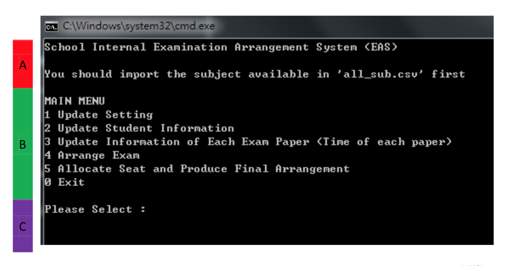
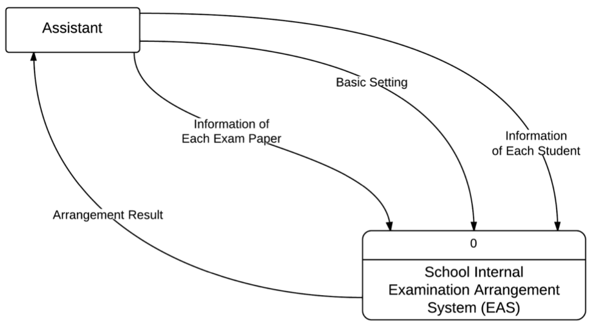
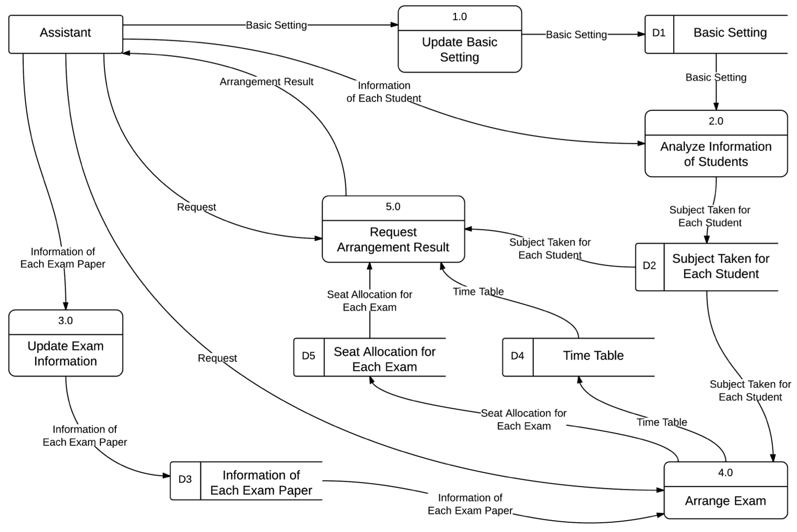
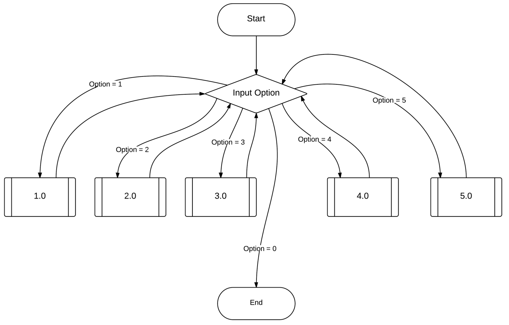

# Hong Kong School Internal Examination Seating Arrangement System

## Statement
I did this project and the write up in high school. I was bad in documentation and English so sorry for that.

## Objectives
### Background
High school students studying in Hong Kong local schools are required to take part in 4 compulsory subjects, 1-3 elective subjects and an optional extended part of Mathematics module 1 or 2 (M1 or M2) under the New Senior Secondary (NSS) curriculum. There was a huge variety of subject combinations for them. There were about 600 students in Form 4 to Form 6 in my high school, and they all took different combinations of elective courses. Apart from the compulsory subjects, there were 11 elective subjects, and M1, M2 available for students to take.

All students were required to complete the papers in the hall at the same time, and therefore *(i)* seat allocation in hall centre was required. *(ii)* A general examination timetable and *(iii)* specific slips of admission form for each candidate were also necessary. The form should include information such as:
- Student name
- Class and class number
- Papers taken
- Date and time of each paper arranged in chronological order
- Location of examination for each paper

The specific slip of admission form should look like this:

<table>
  <tr><th colspan="5">Eden's High School 2012-2013 Final Examination</th></tr>
  <tr><th colspan="5">AU, Eden 5E (1)</th></tr>
  <tr><td>Date</td><td>Time</td><td>Paper</td><td>Venue</td><td>Seat No.</td></tr>
  <tr><td>10 June (Mon)</td><td>08:30-10:00</td><td>English 1</td><td>Hall</td><td>278</td></tr>
  <tr><td>10 June (Mon)</td><td>10:30-12:30</td><td>English 2</td><td>Hall</td><td>278</td></tr>
  <tr><td>11 June (Tue)</td><td>08:30-10:45</td><td>Mathematics</td><td>Hall</td><td>341</td></tr>
  <tr><td>13 June (Thur)</td><td>08:30-09:45</td><td>Chinese 1</td><td>Hall</td><td>271</td></tr>
  <tr><td>13 June (Thur)</td><td>10:45-12:15</td><td>Chinese 2</td><td>Hall</td><td>271</td></tr>
  <tr><td>14 June (Fri)</td><td>08:30-10:30</td><td>Liberal Studies</td><td>Hall</td><td>266</td></tr>
  <tr><td>18 June (Tue)</td><td>08:30-10:30</td><td>Chemistry</td><td>Hall</td><td>273</td></tr>
</table>

### System Requirements and Benefits
The Examination Seating Arrangement System (ESAS) aims to provide a convenient way to lay out pre-exam preparation such as timetable arrangement, seat allocation etc.. The program has the following requirements:
- Clear interface for users – manager and assistant of examination. Clear instructions should be displayed to guide them.
- Data of students can be imported for executing different tasks.
- Subject crash comparison (students doing the same combinations of courses) can be calculated and the best solution of timetable arrangement with the least crash can be found.
- Seat numbers should be allocated in order of class and class number for management convenience.
- General timetable and specific slips of admission form for all students can be
generated automatically referring to the data imported before and the timetable arranged, which retrenches human power.

It can potentially bring the benefits, for instance
- Reduce time and workload for calculating subject crash comparison
- Avoid human errors
- Perform tasks effectively and analyze data automatically using imported data
- Allocate seats for students in good order

### Work Flow

ESAS requires students’ data and examination information. The former mainly refer to personal profile (e.g. name, class, class number) and subjects each student takes, and it is stored in a spreadsheet file; whereas the latter includes number of papers of each subject, duration of each paper and dates available for the examination period. These inputs are used to calculate subject crashes by exhaustive search in order to set an optimal timetable. Hence, we can then generate the timetable and admission forms for every student. The following flowchart (from top to bottom) illustrates how ESAS can be done by breaking it into different sub-problems.

<table>
  <tr><th colspan="3">ESAS login authentication</th></tr>
  <tr><th colspan="3">Import student data and exam information</th></tr>
  <tr><th colspan="3">Calculate subject crash (exhaustive search)</th></tr>
  <tr><th colspan="3">Arrange exam setting</th></tr>
  <tr><th>Generate timetable</th><th>Generate seat allocation</th><th>Generate admission forms</th></tr>
</table>

## Design
### Interface

I adopted command line interface but it could potentially be upgraded to a graphical one. The interface contains three parts. Part A shows some reminders to the user. Using the following figure as an example, the system is now reminding the user to import a file called ‘all_sub.csv’. Part B shows the menu containing all procedures which the user can choose to do next. Part C provides a space for the user to input their option among those given procedures. They are expected to input the number representation of the corresponding procedures.

 Yup this was the old name of my system, didn't bother to fix it  

### Procedures
I used Data Flow Diagrams (DFDs) to illustrate how ESAS works. This is a very useful graphical modeling tool and it shows all the main requirements of the system such as processes, data flowing into, out of and within the system, and the way information is stored in the system.

#### Context (Level 0 DFD)
It describes the essence of ESAS. The major flows between the system and the stakeholder (i.e. assistant) is shown below.

Input:
- Information of each student
- Basic setting
- Information of each exam paper
Output:
- Arrangement result

#### Decomposition (Level 1 DFD)
ESAS was divided into five stages: 
- 1.0 Update basic setting
- 2.0 Analyze information of students
- 3.0 Update exam information
- 4.0 Arrange exam
- 5.0 Request arrangement result

There are five various data stored: 
- D1 Basic setting
- D2 Subject taken for each student
- D3 Information of each paper
- D4 Timetable
- D5 Seat allocation for each exam

The following level 1 DFD constructs the main idea of the system after decomposing it into several processes.

#### Interface Logic Flow
The following diagram displays the logic flow on user interface. There should also be one of the options that provide a pathway for user to exit the sysetm if they want to.

